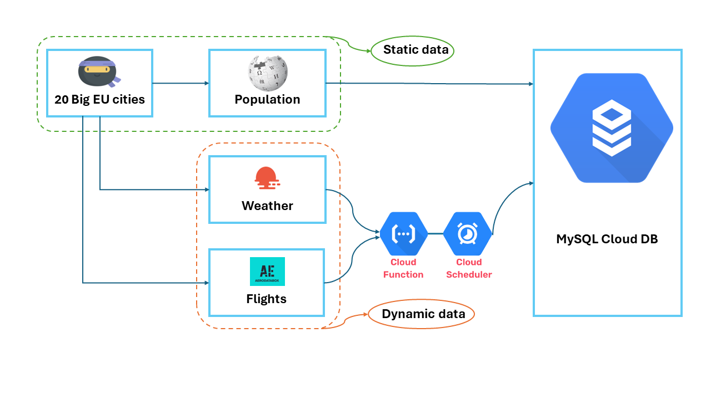
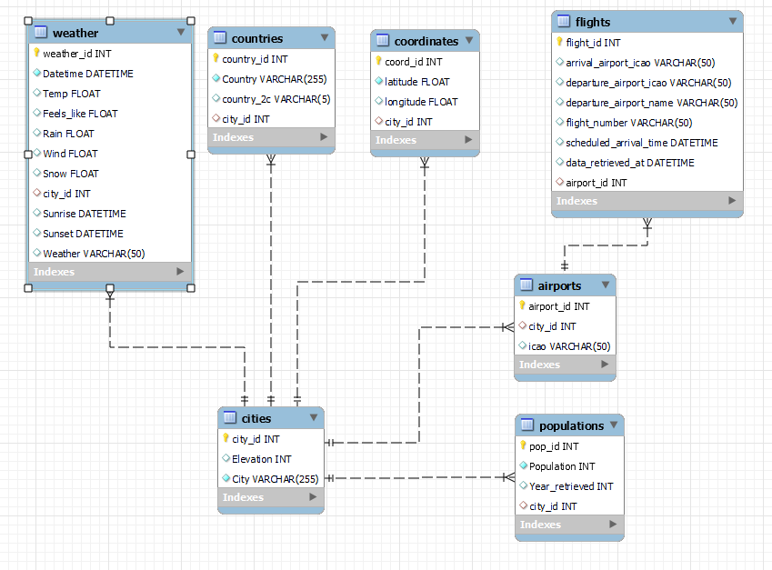

# Gans Data Engineering Case Study: Escooter-sharing System

## Overview

Gans is a startup dedicated to developing an escooter-sharing system, with aspirations to operate in major European cities. The success of Gans hinges on strategically placing scooters where users need them, and the data engineering team has been tasked with gathering weather and flight information to make data-driven predictions about scooter locations.

## Project Execution

The project will unfold in three phases, involving the creation of a local pipeline and its subsequent migration to the cloud. The ultimate goal is to establish a fully automated data pipeline, outlined in the following flowchart: 

### Phase 1: Local Pipeline

In this initial phase, a local data pipeline is built, encompassing the collection, transformation, and storage of data in an SQL database. The entire process is detailed below.

#### 1. Create an Empty SQL Database
An empty SQL database named *gans_cities* is created. The Entity-Relationship (EER) diagram for the database is illustrated here: 

[**Code to Create SQL DB**](https://github.com/sumitdeole/Data_engineering_project/blob/66e23f09cdf732cfdc8572e65cfb14791643caee/code/1.%20Gans_cities.sql)

#### 2. Select Major European Cities using Ninja API
A list of countries where Gans operates is predefined, and the Ninja API is employed to select large cities in these countries with populations exceeding 1,000,000.

[**Code for City Selection using Ninja API**](https://github.com/sumitdeole/Data_engineering_project/blob/1c4d93b96bf54f218dc3784a528a304593025897/code/2.%20select_cities_ninja_api.ipynb)
[**City Data File**](https://github.com/sumitdeole/Data_engineering_project/blob/8ca9be19bb835b7ad8ad173c55fd3a66717f7a74/data/1.%20cities_df_cleaned.csv)

#### 3. Web Scraping using BeautifulSoup
Web scraping is performed on wiki pages to extract population, average elevation, and country information for the selected cities. The data is then integrated into the SQL database.

[**Code for Web Scraping**](https://github.com/sumitdeole/Data_engineering_project/blob/1c4d93b96bf54f218dc3784a528a304593025897/code/3.%20webscraping_beautifulsoup.ipynb)
[**City Data File (Web Scraped)**](https://github.com/sumitdeole/Data_engineering_project/blob/8ca9be19bb835b7ad8ad173c55fd3a66717f7a74/data/2.%20df_cities_ws_cleaned.csv)
[**Code for SQL Integration using SQLAlchemy**](https://github.com/sumitdeole/Data_engineering_project/blob/1c4d93b96bf54f218dc3784a528a304593025897/code/4.%20SQL_integration_sqlalchemy.ipynb)
[**Integrated Data File for SQL**](https://github.com/sumitdeole/Data_engineering_project/blob/8ca9be19bb835b7ad8ad173c55fd3a66717f7a74/data/3.%20df_sql_city_id.csv)

#### 4. Weather Data Collection via OpenWeather API
Weather forecast data for the selected cities is collected using the OpenWeather API. Various weather-related metrics are obtained and stored in the SQL database.

[**Code for Weather Data Collection**](https://github.com/sumitdeole/Data_engineering_project/blob/1c4d93b96bf54f218dc3784a528a304593025897/code/5.%20weather_data_OW_api.ipynb)
[**Weather Data File**](https://github.com/sumitdeole/Data_engineering_project/blob/8ca9be19bb835b7ad8ad173c55fd3a66717f7a74/data/4.%20df_city_id_weather.csv)

#### 5. Flights Data Collection via AeroDataBox API
Flight arrival times for the cities of interest are obtained using the AeroDataBox API. The data includes airport ICAO codes, departure information, and scheduled arrival times.

[**Code for Flights Data Collection**](https://github.com/sumitdeole/Data_engineering_project/blob/1c4d93b96bf54f218dc3784a528a304593025897/code/6.%20flights_data_aerodatabox_api.ipynb)
[**Airport ICAO Codes Data File**](https://github.com/sumitdeole/Data_engineering_project/blob/8ca9be19bb835b7ad8ad173c55fd3a66717f7a74/data/5.%20df_airports_merged.csv)
[**Flights Data File**](https://github.com/sumitdeole/Data_engineering_project/blob/8ca9be19bb835b7ad8ad173c55fd3a66717f7a74/data/6.%20df_flight_arrivals.csv)

### Phase 2: Cloud Pipeline

Details about the cloud pipeline using Google Cloud Platform (GCP), MySQL, Cloud Functions, and Cloud Scheduler will be added here.

### Phase 3: Write a Medium Article

The final deliverable for this project is a comprehensive Medium article summarizing all executed tasks and outcomes.
